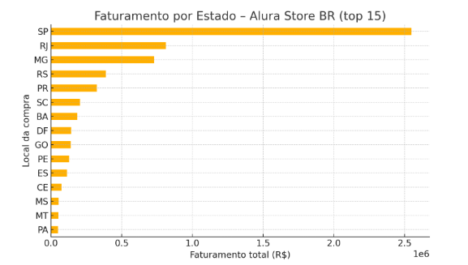

# alura-store-br-analysis
Análise de dados das lojas da Alura Store BR (Desafio Alura Data Science).

# 📊 Alura Store BR — Data Analysis Project



> Exploratory & descriptive analytics for **Alura Store BR** (four virtual shops),
> built in Python / Pandas and documented in a Google Colab notebook.

---

## 🗂 Dataset

| File | Rows | Description |
|------|------|-------------|
| `loja_1.csv … loja_4.csv` | ~17 k each | Raw sales extracted from Alura Store’s Brazilian marketplace (2018‑2022). One file per shop. |
| Columns | – | `Produto`, `Categoria do Produto`, `Preço`, `Frete`, `Data da Compra`, `Local da compra`, `Avaliação da compra`, `lat`, `lon`, … |

The CSVs live in the original **[Alura Challenge repository](https://github.com/alura-es-cursos/challenge1-data-science)** and are pulled on‑the‑fly by the notebook—so you don’t need to version raw data here.

---

## 🔍 Analyses

1. **Faturamento** total e mensal por loja  
2. **Vendas por categoria** (mix de produtos)  
3. **Avaliação média** das lojas  
4. **TOP / BOTTOM 5** produtos mais vendidos  
5. **Frete médio** por loja  
6. **Relatório final** & recomendação de negócio  

> The chart above shows the **geographical distribution of revenue (top 15 states)**—São Paulo unsurprisingly dominates.  
> All figures were produced with Matplotlib and live inside the notebook.

---

## 🚀 Quick start

```bash
# clone repo
git clone https://github.com/<your‑user>/alura-store-br-analysis.git
cd alura-store-br-analysis

# open the notebook in Colab
# https://colab.research.google.com/github/rshermans/alura-store-br-analysis/blob/main/AluraStoreBR.ipynb
